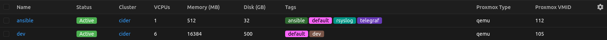

# Nautobot SSoT Proxmox

Unofficial Nautobot SSoT sync script to fetch basic VM information from Proxmox VE (remote) into Nautobot (local).
Creates Virtual machines, Proxmox nodes/clusters, VM interfaces, IP addresses, IP prefixes and custom fields related to proxmox values (e.g., ID and type).


Observed working for:
- Nautobot 3.1.3
- Proxmox VE 9.2.3



## Install

### Proxmox API token

Assuming you're using Proxmox VE, in your Proxmox instance, configure a `User` 
(Datacenter > Permissions > Users) and an `API token` (Datacenter > Permissions > API Tokens).
Configure scope/permissions (Datacenter > Permissions) for the user, API & group with Path: `/` and Role `PVEAuditor`.
Permissions can likely be scoped even smaller by adjusting path and creating a new role.

### Nautobot plugin

Currently, the plugin is not uploaded to any other platforms than GitHub. The recommended steps are to install it locally.

Clone the repository
````bash
git clone https://github.com/HarbourHeading/nautobot-ssot-proxmox.git
````

Update `local_requirements.txt` or equivalent dependency configuration (e.g. `pyproject.toml`) to include
````
nautobot-ssot-proxmox @ file:///srv/nautobot/nautobot-ssot-proxmox
````

Enable and configure the plugin in `nautobot_config.py`. NOTE: Example has secrets in config. Limit access to the config,
alternatively fetch from `.env` or equivalent mem store.
````python
PLUGINS = ["nautobot_ssot", "nautobot_ssot_proxmox"]

PLUGINS_CONFIG = {
    "nautobot_ssot_proxmox": {
        "proxmox_url": "https://pve.example.com",
        "proxmox_port": "443",  # defaults to 8006 if not set
        "proxmox_user": "nautobot-sync@pam",
        "proxmox_token_name": "nautobot-sync-token",
        "proxmox_token_value": "jc73dsef-3gr4-3gry-cgd4-a257hnjlfdwa",
        "verify_ssl": True,
        "cluster_name": "homelab",
        "cluster_type_name": "Proxmox VE",
        "certificate": "/srv/nautobot/client_certificate.p12", # optional
        "certificate_passphrase": "my-password",  # optional
        "http_proxy": "http://proxy.example:3128", # optional
        "https_proxy": "http://proxy.example:3128", # optional
    },
}
````

Reload nautobot
````
nautobot-server post_upgrade
````

Then restart nautobot
````
systemctl restart nautobot nautobot-worker nautobot-scheduler
````

## Run

Just run the nautobot job `Proxmox -> Nautobot`

## Development

The repo does not host or provide steps to set up its own nautobot development environment.

Clone the repository
````bash
git clone https://github.com/HarbourHeading/nautobot-ssot-proxmox.git
````

Change directory
````bash
cd nautobot-ssot-proxmox
````

Install dependencies with poetry
````bash
poetry lock ; poetry install
````

On a new version, bump the version in [pyproject.toml](pyproject.toml).

## Roadmap

- [X] Fetch Clusters/nodes and Virtual Machines (QEMU & LXC).
- [X] Fetch VM disks to get total disk space.
- [X] Fetch VM network devices to get and create IP Addresses, ip ranges and interfaces.
- [X] Add tags from proxmox.
- [X] Add Custom field for [hostname](https://pve.proxmox.com/pve-docs/api-viewer/#/nodes/{node}/qemu/{vmid}/agent/get-host-name).
- [ ] Add VLANs for interfaces.
- [ ] Add parent interfaces from the cluster and add a reference onto the vm interfaces.
- [ ] Add MTU support for interfaces.
- [ ] Add MAC address support for interfaces.
- [ ] Add custom fields of most [VM config data](https://pve.proxmox.com/pve-docs/api-viewer/#/nodes/{node}/qemu/{vmid}/config).
- [ ] Add support for [nautobot firewall model](https://docs.nautobot.com/projects/firewall-models/en/latest/).